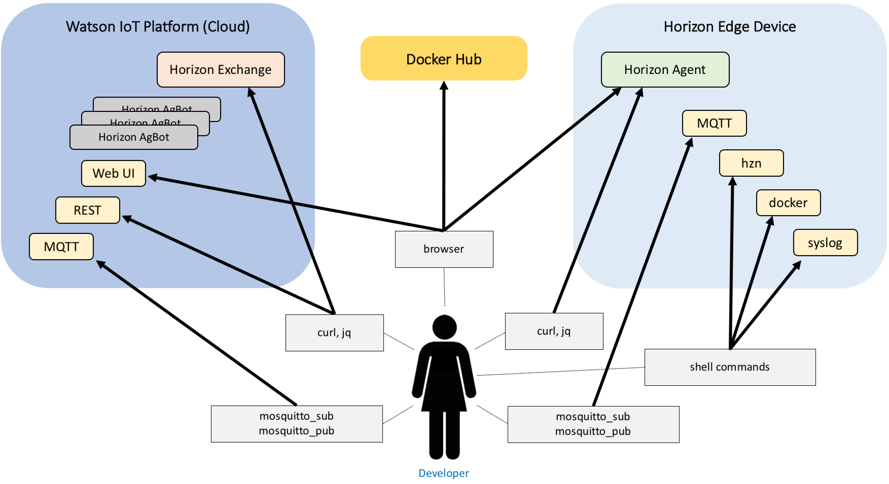
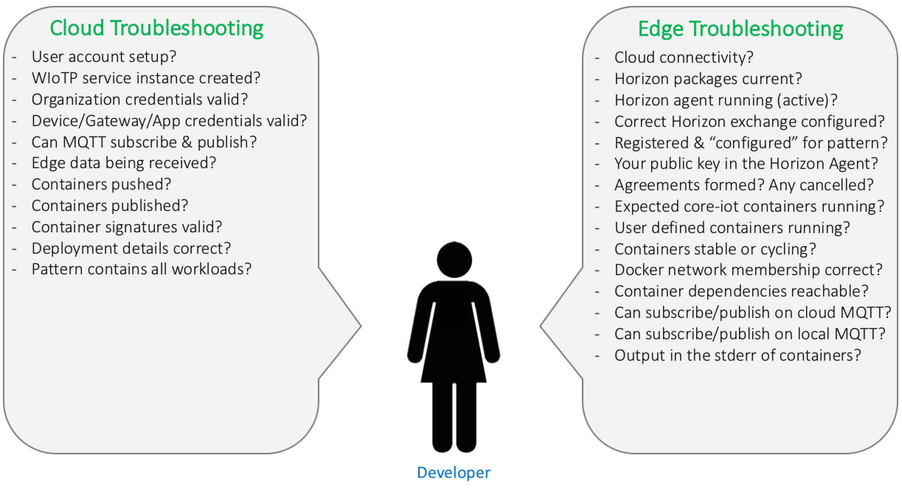

# Troubleshooting

This troubleshooting guide describes the main components of the Edge system, and how to interrogate them to determine the state of the system.  Many interfaces are provided that expose state information.  Some of this information is available through graphical web interfaces, but most of it is available through HTTP REST APIs.  On the edge nodes a Linux shell command line tool, "hzn" is available primarily as a wrapper to simplify access to these REST interfaces.

In addition to providing graphical web interface and REST APIs, the Watson IoT Platform widely uses MQTT messaging.  Often you can troubleshoot issues by manually connecting to the Watson IoT MQTT brokers on the edge node or in the cloud to subscribe, and to publish test messages.  The widely used "mosquitto-clients" package provides command line tools "mosquitto_sub" and "mosquitto_pub" that simplify manually subscribing and publishing (respectively).  Note that "mosquitto" is spelled with 2 letters "t" in all of these cases.

On the edge node you may also need to troubleshoot host issues, the underlying Horizon software, docker issues, and the code running in your containers.  If it becomes necessary to troubleshoot docker issues, docker tools and interfaces will be used, and they are covered superficially here.  There already exists a plethora of easily searchable information from other sources on how to troubleshoot docker.

The figure below shows the interfaces provided to expose state, and the recommended tools for accessing these interfaces.


Figure 1: Some of the interfaces available for exposing the state of the system. 

Note that on Edge Nodes where Horizon is installed, the `hzn` command is probably the most useful tool you will have for debugging issues with the local Horizon Agent and the remote Horizon Exchange in the cloud.  The "hzn" command has built-in online help, so if you don't know what command to use, or details on how to use a particular command, try "hzn --help" or "hzn \<subcommand\> --help" to get detailed information.

Mostly the "hzn" command is a wrapper for the HTTP REST APIs provided.  It is designed as a user convenience, to simplify access to system state information.  On nodes where the Horizon packages are not supported or not installed, you can directly use the HTTP REST APIs instead (e.g., using "curl" or other CLI utilities, or by writing a program in a language that supports REST queries well).  Similarly, the Watson IoT Platform provides a wide array of graphical web pages to make access convenient for human users, but there is also an HTTP REST API you can use directly (either manually or in your code).

The documentation for the Horizon Exchange's REST API is here:

 * [https://exchange.bluehorizon.network/api/api](https://exchange.bluehorizon.network/api/api)

The documentation for the Horizon Agent REST API is here:

 * [https://github.com/open-horizon/anax/blob/master/doc/api.md](https://github.com/open-horizon/anax/blob/master/doc/api.md)

The documentation for the Watson IoT Platform REST API is here:

 * [https://console.bluemix.net/docs/services/IoT/devices/api.html#api](https://console.bluemix.net/docs/services/IoT/devices/api.html#api)

The remainder of this document will ask questions about the state of your system.  You will find a brief discussion about why the answer to each question is relevant, and then a detailed guide showing you how to determine the answer within your system.

The questions are grouped into two sections, could troubleshooting, and edge troubleshooting.  The nature of debugging in each of these environments is quite different since you have complete access to, and control over, your edge node.  The figure below shows some of the questions that are useful to answer on each side when trying to troubleshoot problems.


Figure 2: Questions the developer can use to diagnose problems in the system. 


## Cloud Troubleshooting

### **Is your IBM Cloud User account setup correctly?**

Of course you need an IBM Cloud account to do anything in the IBM Watson IoT Platform.  You can verify your IBM Cloud credentials by logging in here: [https://console.bluemix.net/](https://console.bluemix.net/)

Note that although the IBM cloud provides a free tier of access, there are limits in that tier.  If you exahaust what is available in the free tier you will need to transition to a paid account and provide payment details.

### **Have you successfully provisioned a Watson IoT Platform service instance?**

A Watson IoT Platform servcie instance must be provisioned in order to enable the cloud side MQTT broker for your organization, and Horizon agbots for yourEdge Node deployment patterns.  If you have not already done so, you can provision a servcie instance, here:

 * [https://console.bluemix.net/dashboard/apps/](https://console.bluemix.net/dashboard/apps/)

If you already have a Watson IoT Platform organization service instance configured, you should be able to access it using a URL of the form shown below (replacing "ORGID"  with your 6-character organization ID):

 * [https://ORGID.internetofthings.ibmcloud.com/dashboard](https://ORGID.internetofthings.ibmcloud.com/dashboard)

### **Do you have appropriate access to your organization within the Watson IoT Platform?**

As noted under the previous question, once you login you should be able to access your organization using a URL of the form below (replacing "ORGID" with your 6-character organization ID).

 * [https://ORGID.internetofthings.ibmcloud.com/dashboard](https://ORGID.internetofthings.ibmcloud.com/dashboard)

That should take you to your organization's dashboard page.  There you can select "Members" in the left menu panel and see a list of all of the people with access to your organization, and the "roles" they have been assigned.  If you tap the "Roles" tab at the top of the panel presented, you can view all of the permissions granted to each role.  If you or another member does not have the permissions they require, someone with the Administrator role can modify their access role.

### **Have you correctly configured Device, Gateway, and App (i.e., API Key) credentials in the Watson IoT Platform?**

The [Developer Guide](https://github.com/open-horizon/examples/wiki/Edge-Developer-Guide) contains a detailed walkthrough showing how to enable the experimental edge capabailities switches (2 of them) and define various types, instances and tokens for access.  Although the tokens cannot be viewed in the Watson IoT Platform graphical web pages after they have been set, everythign else can be checked using the menus on the left of your organization's dashboard page.

Tap "Devices" in the left menu panel to see the device instances you have created (Devices and Gateways) and their types.  Tap "Apps" in the left panel to view your API Keys.

You can also verify your Device, Gateway, and App credentials using MQTT.  This is shown in the next question below.

### **Are you able to subscribe and publish to your organization's MQTT instance in Watson IoT Platform?**

Subscribing and publishing to the Watson IoT Platform MQTT instance for your organization is a good way to verify that your credentials are correct and that your service instance is running in the cloud.

An easy way to do this is to install the "mosquitto-clients package, e.g.:

```
sudo apt-get install -y mosquitto-clients
```

After installing that package you should be able to subscribe using a command similar to the one shown below (but with your credentials replacing the environment variable references shown here:

```
mosquitto_sub -v -h $WIOTP_ORG_ID.messaging$WIOTP_TEST_ENV.internetofthings.ibmcloud.com -p 8883 -i "a:$WIOTP_ORG_ID:myappid" -u "$WIOTP_API_KEY" -P "$WIOTP_API_TOKEN" --capath /etc/ssl/certs -t iot-2/type/$WIOTP_GW_TYPE/id/$WIOTP_GW_ID/evt/status/fmt/json
```

That subscribe command should block indefinitiely, waiting for publications and showing them whenever they are receieved.

In another shell you could then publish to the cloud with a command similar to the folowing:

```
mosquitto_pub -h $WIOTP_ORG_ID.messaging$WIOTP_TEST_ENV.internetofthings.ibmcloud.com -p 8883 -i "g:$WIOTP_ORG_ID:$WIOTP_GW_TYPE:$WIOTP_GW_ID" -u "use-token-auth" -P "$WIOTP_GW_TOKEN" --capath /etc/ssl/certs -t iot-2/type/$WIOTP_GW_TYPE/id/$WIOTP_GW_ID/evt/status/fmt/json -m '{"message": "Hello, world."}'
```

When you do that you should soon thereafter see the "Hello, world." message in the shell where you are subscribed.

You should also be able to see messages arriving in the Watson IoT Platform graphical web pages: go to your organizations dashboard URL, tap on Devices, then select your device or gateway, and tap the "Recent Events" tab, and there you will be able to observe message as they are received because these web pages subscribe to the same topic used above.

### **Were your containers successfully pushed to your docker registry?**

Your normal development process will be to build and tag your container images, then login to Docker Hub, and push them.  It is a good idea to then go to Docker Hub to verify that your container images are in Docker Hub and named and versioned as you intended.

To verify your container image names and versions, go to [https://hub.docker.com/](https://hub.docker.com/), then login to your user account and review your "Repositories".

### **Did you successfully publish your containers to the Horizon Exchange?**

The Horizon Exchange is the central warehouse for metadata about your published code for your Edge Nodes.  If you have not signed and published your code to the Horizon Exchange then it cannot be pulled down to your edge nodes, verified, and run.  So it is useful to verify that your microservice container and workload container publications were successful.

If you have a Horizon edge node where you have already run `wiotp_agent_setup`, you can do this with the following "hzn" command (providing your own values for the environment variables):

```
hzn exchange -u "$WIOTP_API_KEY:$WIOTP_API_TOKEN" microservice list -o $WIOTP_ORG_ID
```

If you don't have Horizon installed and therefore cannot use the "hzn" command, you can instead use the REST API directly.  For example, a "curl" comand with the following form will retrieve the list of microservices published to the exchange for your organization (be sure to set the appropriate environment variable values first):

```
curl -sS -w "%{http_code}" -u "$WIOTP_API_KEY:$WIOTP_API_TOKEN" https://$WIOTP_ORG_ID.internetofthings.ibmcloud.com/api/v0002/edge/orgs/0ayswk/microservices | jq .
```

Similarly, the command below will retrieve the list of your published workloads:

```
curl -sS -w "%{http_code}" -u "$WIOTP_API_KEY:$WIOTP_API_TOKEN" https://$WIOTP_ORG_ID.internetofthings.ibmcloud.com/api/v0002/edge/orgs/0ayswk/microservices | jq .
```

### **Are you able to use your public key to verify the signatures of the containers you published?**

If you have a Horizon edge node where you have already run `wiotp_agent_setup`, you can verify that your microservice deployment signatures are valid with an "hzn" command of the following format (providing your own values for the environment variables):

```
hzn exchange -u "$WIOTP_API_KEY:$WIOTP_API_TOKEN" microservice verify -o $WIOTP_ORG_ID -k $PUBLIC_KEY_FILE internetofthings.ibmcloud.com-microservices-${MICROSERVICE_NAME}_${MICROSERVICE_VERSION}_${MICROSERVICE_ARCHITECTURE}

```

Similarly, the command below can be used to validate your workload deployments:

```
hzn exchange -u "$WIOTP_API_KEY:$WIOTP_API_TOKEN" workload verify -o $WIOTP_ORG_ID -k $PUBLIC_KEY_FILE internetofthings.ibmcloud.com-microservices-${WORKLOAD_NAME}_${WORKLOAD_VERSION}_${WORKLOAD_ARCHITECTURE}
```

### **Is the deployment information for your containers correct (e.g., docker run arguments that provide access to hardware device paths)?**

If you have a Horizon edge node where you have already run `wiotp_agent_setup`, you can get your containers' deployment information by pulling their listings from the Horizon Exchange with an "hzn" command of the following form (providing your own values for the environment variables).  In the output that results from these commands, check the "deployment" field.

For microservices:

```
 hzn exchange -u "$WIOTP_API_KEY:$WIOTP_API_TOKEN" microservice list -o $WIOTP_ORG_ID internetofthings.ibmcloud.com-microservices-${MICROSERVICE_NAME}_${MICROSERVICE_VERSION}_${MICROSERVICE_ARCHITECTURE} | jq .

```

For workloads:

```
 hzn exchange -u "$WIOTP_API_KEY:$WIOTP_API_TOKEN" workload list -o $WIOTP_ORG_ID internetofthings.ibmcloud.com-microservices-${WORKLOAD_NAME}_${WORKLOAD_VERSION}_${WORKLOAD_ARCHITECTURE} | jq .

```

Similarly you can get this information directly from the exchange using somthing like this:

```
curl -sS -w "%{http_code}" -u "$WIOTP_API_KEY:$WIOTP_API_TOKEN" https://$WIOTP_ORG_ID.internetofthings.ibmcloud.com/api/v0002/edge/orgs/$WIOTP_ORG_ID/patterns/$WIOTP_GW_TYPE | jq .
```

### **Does the deployment Pattern you published contain all of the expected workloads and versions?**

If you have a Horizon edge node where you have already run `wiotp_agent_setup`, you can get your containers' deployment pattern details by pulling its listing from the Horizon Exchange with an "hzn" command of the following form (providing your own values for the environment variables):

```
hzn exchange -u "$WIOTP_API_KEY:$WIOTP_API_TOKEN" pattern list -o $WIOTP_ORG_ID $WIOTP_GW_TYPE | jq .

```

Similarly you can get this information directly from the exchange using somthing like this:

```
curl -sS -w "%{http_code}" -u "$WIOTP_API_KEY:$WIOTP_API_TOKEN" https://$WIOTP_ORG_ID.internetofthings.ibmcloud.com/api/v0002/edge/orgs/$WIOTP_ORG_ID/patterns/$WIOTP_GW_TYPE | jq .
```

Use the instructions in the previous sections to list the referenced workloads, and then from there to list the reference microservices, to verify everything set correctly.

## Edge Troubleshooting

### **Does the edge node have connectivity to external network resources?**

Edge Nodes often have intermittent connectivity to the Internet, and Horizon with Watson IoT provides store-and-forward services to mititage this and ensure that data created when offline will be forwarded when connectivity is resumed.

However, during setup of an Edge Node connectivity to the internet is required.  Also, many of the diagnostic procedures in this troubleshooting guide require connectivity.  So if your Edge Node has unreliable network access it would be a good idea to verify connectivity if you run into problems with any of these diagnostic procedures.

A simple way to verify connectivity is to "ping" Google's public DNS endpoint, at address "8.8.8.8".  E.g.:

```
ping 8.8.8.8
```

If you are connected you should see successful echo replies shown from that command.

### **Are the currently released versions of the Horizon packages installed?**

You can check the versions of the horizon packages that are installed by using the "dpkg" command, ash shown below:

```
dpkg -l | grep horizon
```

You should be using version "2.15.2" or later.

### **Is the Horizon Agent currently up and running (active)?**

You can check on the status of the Horizon Agent with the "systemctl" utility:

```
sudo systemctl status horizon
```

You should see a line similar to this in the output of the above command:

```
   Active: active (running) since Fri 2018-02-02 15:00:04 UTC; 2h 29min ago
```

You can also verify that you can communicate with the Horizon Agent API:

```
hzn node list | jq .
```

### **Is the edge node configured to interact with the correct Horizon exchange instance (internal users only)?**

This troubleshooting tip only applies to internal users of Horizon who are running Horizon in development, testing, or staging environments not accessible by external users.

Once you have run the `wiotp_agent_setup` command to register your edge node with Horizon you can view the local Horizon Agent configuration for the node to see the Horizon Exchange being used, with the command below:
```
hzn node list | jq .configuration.exchange_api
```

### **Why aren't the expected docker containers running on my edge node?**

Normally when your edge node is registered with WIoTP Horizon, a Horizon Agbot will make an agreement with it to run the workloads and microservices referenced in your gateway type (pattern). If that does not happen, here are some things to check.

Confirm your edge node is in the `configured` state with the `id`, `organization`, and `pattern` you expected, and that the architecture Horizon is reporting is the same architecture that you used in the metadata of your workload and microservice:

```
hzn node list | jq .
```

Sometimes it looks like no agreements are being made because `hzn agreement list | jq .` does not show anything. But sometimes agreements are formed and then there is a problem with running the containers so the agreement is cancelled before you see it on the active list. In this case, the agreement is put on the archived list with a `terminated_description`. Show them using:

```
hzn agreement list -r | jq .
```

Sometimes problems occur before an agreement is even created, so an agreement doesn't make it onto the active or archived agreement lists. In this case, you need to look for errors reported by the horizon agent in syslog:

```
grep --color=auto --text -E ' anax\[[0-9]+\]: E[0-9]{3}' /var/log/syslog
``` 

A few possible errors you may see in syslog are:

- The signature of the workload/microservice metadata (specifically the `deployment` field) could not be verified. This usually means you have not imported your signing public key into your edge node using `hzn key import -k <pubkey>`. You can view the keys that have been imported on your local edge with `hzn key list`. You can verify that the workload metadata in the exchange was signed with the key you think it was with `hzn exchange workload verify -k $PUBLIC_KEY_FILE <workload-id>`, where workload-id is usually something like `$WIOTP_DOMAIN-workloads-cpu2wiotp_${CPU2WIOTP_VERSION}_${ARCH2}`.
- The path of docker image in the workload/microservice `deployment` field is incorrect. Confirm that on your edge node you can `docker pull` that image path.
- The Horizon Agent on your edge node does not have access to the docker registry holding your images. If the docker images in the remote docker registry are not world-readable, you must add the credentials to your edge node using `docker login ...`. (This is a 1 time step and will be remembered on this edge node.)

If a container is constantly restarting (`docker ps` shows it as up for only a few seconds or "restarting"), look at the container's log messages to determine why it is exiting:
```
grep --text -E ' <workload>\[[0-9]+\]' /var/log/syslog
```

### **Are the expected Watson IoT Platform "core-iot" container versions running?**

The Watson IoT Platform "core-iot" containers are governed by the base agreement created after you run `wiotp_agent_setup`.  At the time of writing there are 4 containers specified in this agreement.  You should begin by verifying that your Edge Node has a current agreement for the "edge-core-iot-workload".  The command below can be used to view your currently active agreements:
```
hzn agreement list | jq .
```

Once you have confirmed you have the core-iot agreement running, use this command to view the running containers:
```
docker ps
```

Eventually you should see the 4 core-iot containers running.  Note that it may take the Horizon Agent several minutes after the agreement is accepted before your containers can be downloaded, verified and run.  So be pateint.

### **Are the expected user-defined container versions running?**

Similar to the above, your containers are governed by an agreement created after you added your workload to the base pattern, and you ran `wiotp_agent_setup`.  You should begin by verifying that your Edge Node has a current agreement for your workload.  Note that this agreement is in addition to the "edge-core-iot-workload" (i.e., you should see 2 current agreements when you run the command below).

```
hzn agreement list | jq .
```

If you have confirmed that you have the agreement for your woprkload running, you can use the command below to view the running containers and make sure your user-defined containers are there running in addition to the core-iot containers:
```
docker ps
```

Again, note that it may take the Horizon Agent several minutes after the agreement is accepted before the corresponding containers are downloaded, verified and run.  So be pateint.

The commands below can also be used to query the local Horizon Agent about the currently active (corresponding to currently active agreements) and inactive containers, respectively:
```
curl -s http://localhost/microservice | jq '.instances.active'
curl -s http://localhost/microservice | jq '.instances.archived'
```

### **Are the expected containers stable or are they "cycling" (e.g., failing and being restarted by the Horizon Agent)**

When you run:
```
docker ps
```
you can see how long each of the containers has been running.  If, over time, you observe your containers restarting, you should check the logs of your containers for errors.

If you have configured indivudual workload logging as described in the detailed version of the [Developer Guide](https://github.com/open-horizon/examples/wiki/Edge-Developer-Guide#configuring-individual-logging-for-each-workload), then your containers will each log into a separate file in ```/var/log/workload/```.  Use the ```docker ps``` command to find the full names of your containers, then look for a file of that name, with a ".log" suffix, in thid directory.

If you have not done that configuration, then your workload is logging to syslog along with everything else, so you will need to search for its output in "/var/log/syslog", e.g.:
```
grep YOURWORKLOADNAME /var/log/syslog
```

### **Are the containers docker-networked as expected (e.g., to enable access to required microservices)?**

You can view the docker virtual networks that are active on your Edge node with the command below:
```
docker network list
```
To get more information about any of those networks you can use the ```docker inspect X``` command where "X" is the network you wish to inspect.  In the output of that command you will see all of he containers that are running on that virtual network.

You may also wish to run ```docker inspect Y``` on each conatiner (Y) to get more information.  Specifically look in "NetworkSettings" then inside that, find "Networks" then in there you should see the relevant network ID string, and information about how this container is represented on the network, including its "IPAddress", and the list of network "Aliases" that it has on this network.  The latter is important because those alias names are available to all of the containers on this virtual network, and they are typically how the containers in your code deployment pattern will discover each other on the virtual network.  For example, you might name your service "myservice", then other containers should be able to use that name directly to access it on the network, e.g.: ```ping myservice```.

The alias name of your container is specified in the "deployment" field of its microservcie definition file (the one that you pass to the "hzn exchange microservcie publish" command).

The [docker command reference](https://docs.docker.com/engine/reference/commandline/docker/#child-commands) contains more detailed information about the commands supported by the docker command line interface.

### **Within the context of your container (e.g., using "docker exec ...") are your dependency containers (i.e., required microservices) reachable?**

It is useful to enter the context of your running container to troubleshoot issues at runtime.  The "docker exec" command facilitates this.  Use the "docker ps" command to find the identifier of your running container, then use a command similar to this to enter its context (replacing CONTAINERID with your container's identifier:
```
docker exec -it CONTAINERID /bin/sh
```

If you container contains bash (many do not) then you may wish to specify "/bin/bash" at the end of the above command instead.

The [docker command reference](https://docs.docker.com/engine/reference/commandline/docker/#child-commands) contains more detailed information about the commands supported by the docker command line interface.

### **Are you able to manually subscribe/publish to the Watson IoT Platform cloud MQTT for your organization, using your Device, Gateway, or App (API Key) credentials?**

If your container is having trouble publishing to the Watson IoT Platform in the cloud, you can work on debugging this by executing host commands on yoour Edge Node.  For example, if you configure the shell environment variables used below, this command will subscribe to your event stream from the Watson IoT Platform.
```
mosquitto_sub -v -h $WIOTP_ORG_ID.messaging$WIOTP_TEST_ENV.internetofthings.ibmcloud.com -p 8883 -i "a:$WIOTP_ORG_ID:myappid" -u "$WIOTP_API_KEY" -P "$WIOTP_API_TOKEN" --capath /etc/ssl/certs -t iot-2/type/$WIOTP_GW_TYPE/id/$WIOTP_GW_ID/evt/status/fmt/json
```
That command will block, awaiting messages on that stream.  Any events posted to that stream will then appear in that terminal.

Similarly, the command below will publish a message to your event stream in the Watson IoT Platform cloud:
```
mosquitto_pub -h $WIOTP_ORG_ID.messaging$WIOTP_TEST_ENV.internetofthings.ibmcloud.com -p 8883 -i "g:$WIOTP_ORG_ID:$WIOTP_GW_TYPE:$WIOTP_GW_ID" -u "use-token-auth" -P "$WIOTP_GW_TOKEN" --capath /etc/ssl/certs -t iot-2/type/$WIOTP_GW_TYPE/id/$WIOTP_GW_ID/evt/status/fmt/json -m '{"message": "Hello, world."}'
```
If you run the above "mosquitto_pub" command in another terminal, and if the "mosquitto_sub" command shown above was still running in the first terminal when you did the "mosquittp_pub" command then you would see the message you published being echoed back into the subscribed terminal.

### **Are you able to manually publish to the local Watson IoT Platform MQTT broker (running in the core-iot containers on your Edge Node)?**

In the previous example, the host target (passed after "-h" in the "mosquitto_pub" command) is your Watson IoT Platform organization URL in the cloud.  However, Edge Node applications will usually communicate with the **local** MQTT broker on the Edge Node instead.  This local broker requires simpler authentication, because it only accepts local connections.  The local broker also implements a basic "store-and-forward" architecture that will cache your messages locally whenever there is a network outage on the Edge Node (reliable network communications is a common problem with small edge devices).

To verify that you can communicate through the **local** MQTT broker you can publish a message with a command of this form:
```
mosquitto_pub -h localhost -p 8883 -i "g:$WIOTP_ORG_ID:$WIOTP_GW_TYPE:$WIOTP_GW_ID" -u "use-token-auth" -P "$WIOTP_GW_TOKEN" --cafile /var/wiotp-edge/persist/dc/ca/ca.pem -t iot-2/type/$WIOTP_GW_TYPE/id/$WIOTP_GW_ID/evt/status/fmt/json -m '{"message": "Hello from the edge"}' -d
```

Notice that "-h localhost" was used here.

Inside your container, which is attached to the same docker network as the core-iot services, you would instead use "-h edge-connector" to send your message.

### **Are your user-defined containers emitting error messages to the log?**

If you have configured indivudual workload logging as described in the detailed version of the [Developer Guide](https://github.com/open-horizon/examples/wiki/Edge-Developer-Guide#configuring-individual-logging-for-each-workload), then your containers will each log into a separate file in ```/var/log/workload/```.  Use the ```docker ps``` command to find the full names of your containers, then look for a file of that name, with a ".log" suffix, in thid directory.

If you have not done that configuration, then your workload is logging to syslog along with everything else, so you will need to search for its output in "/var/log/syslog", e.g., replacing YOURWORKLOAD below with the name of your container:
```
grep YOURWORKLOAD /var/log/syslog
```


